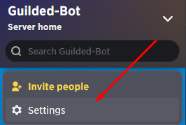
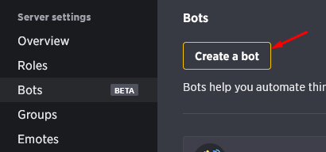
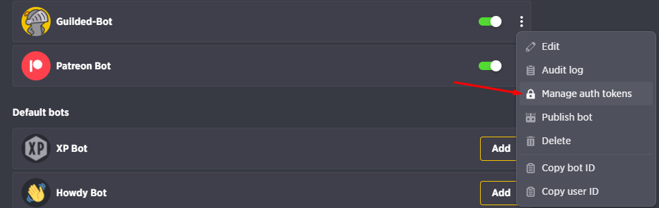
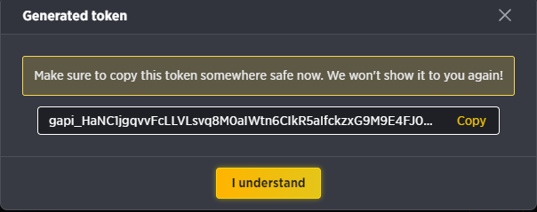

import Callout from 'nextra-theme-docs/callout'
# Creating your bot
Now you have all necesary for start coding your bot, but first you need to create a bot via [Guilded](https://www.guilded.gg) application. 

1. Go to [Guilded](https://www.guilded.gg) and login.
2. Go to Guild Settings. 
#

3. Go to the Bots tab.
4. Click on the "Create a Bot" button.
#

5. Fill in the form and click on the "Create Bot" button.
6. Go to the three dots on the right side of the bot and click on the "Manage auth tokens" button.
7. Click on the "Generate Token" button.
8. Copy the token and save it somewhere safe.
#

