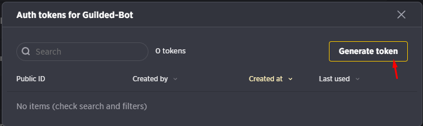

import Callout from 'nextra-theme-docs/callout'
# Setting up a bot
## Creating your bot
Now you have all necesary for start coding your bot, but first you need to create a bot via [Guilded](https://www.guilded.gg) application. 

1. Go to [Guilded](https://www.guilded.gg) and login.
2. Go to Guild Settings. 
#

3. Go to the Bots tab.
4. Click on the "Create a Bot" button.
#

5. Fill in the form and click on the "Create Bot" button.
6. Go to the three dots on the right side of the bot and click on the "Manage auth tokens" button.
7. Click on the "Generate Token" button.
8. Copy the token and save it somewhere safe.
#




### Opening a new terminal
<Callout emoji="❗" type="warning">
  In this tutorial we are going to use the Windows Terminal and Visual Studio Code. If you are using another terminal, editor or OS, you need to find the equivalent commands.
</Callout>

Open the Windows Terminal and type `cd` and then drag the folder into the terminal. 
It should look like this: `cd C:\Users\YourName\bot`. (Replace `YourName` with your username and `bot` with the path to your folder)

Now you are in the folder.

### Initializing the project
```bash
npm init
```
This command will initialize the project and create a `package.json` file. This file is going to store all the dependencies and other information about the project. You can edit this file later.

This command will ask you some questions, you can just press enter to skip them. The only thing you need to change is the `entry point` to `index.js`. This is the file where the bot is going to start.

<Callout emoji="🔔">
    If you want skip the questions, you can use the `-y` flag. This will skip all the questions and use the default values.
    ```bash
    npm init -y
    ```
</Callout>

### Installing Guilded-Bot

Now you need to install Guilded-Bot for your project. You can do this with the following command:

```bash
npm install guilded-bot
```

This command will install Guilded-Bot and all the dependencies for you. After this command is finished, you can start coding your bot.

### Linter and Formatter (Optional)
While you are developing your bot, you should use a linter and a formatter. This will help you to find errors and format your code. You can use the following commands to install them:

```bash
npm install --save-dev eslint
npm install --save-dev prettier
```

After this command is finished, you can create a `.eslintrc.json` file and a `.prettierrc` file. You can copy the following code into the files:

`.eslintrc.json`
```json
{
  "extends": ["eslint:recommended", "plugin:prettier/recommended"],
  "parserOptions": {
    "ecmaVersion": 2020
  },
  "env": {
    "es6": true,
    "node": true
  }
}
```

`.prettierrc`
```json
{
  "singleQuote": true,
  "trailingComma": "es5"
}
```

If you want, you can customize the files to your needs. You can find more information about the files [here](https://eslint.org/docs/user-guide/configuring) and [here](https://prettier.io/docs/en/configuration.html).