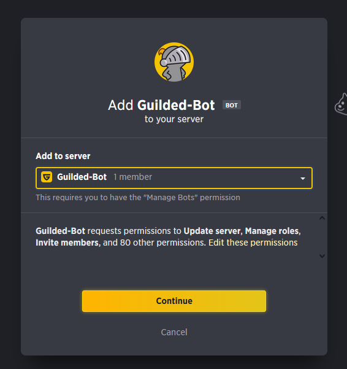

# Adding your bot to servers

Now, before we start coding, we need to invite our bot to our server.

## Bot Invite Links

The invite link of a bot look like this:
```txt
https://www.guilded.gg/b/d95e651d-60bb-456d-870f-361be4074820
```

The link is composed of 3 parts:

* `https://www.guilded.gg/` - The base URL of Guilded
* `b/` - The type of link, in this case a bot link
* `d95e651d-60bb-456d-870f-361be4074820` - The unique ID of the bot

## Creating and inviting bot with invite link

To invite your bot to any server, first we need to get the bot invitation link.

These are the steps you must follow:

- 1. Press three dots on the right side of the bot you want to invite
- 2. Click on "Publish bot"
#

- 3. Copy the link
#


Now, with the link, you can invite your bot to any server you want.
#


## Permissions

When you invite your bot to a server, you can choose which permissions you want to give to the bot. (Recommended to give all permissions)
#


The permissions are:

- Update server
- Manage roles
- Invite members
- Kick / Ban members
- Manage groups
- Manage channels
- Manage webhooks
- Can mention @everyone and @here
- Access moderator view
- Slowmode exception
- View applications
- Approve applications
- Edit applications
- Indicate Find Players interest
- Modify Find Players status
- View announcements
- Create and remove announcements
- Manage announcements
- Read messages
- Send messages
- Upload media
- Create threads
- Send messages in threads
- Send private messages
- Manage messages
- Manage threads
- View events
- Create events
- Manage events
- Remove events
- Edit RSVPs
- Read forums
- Create forum topics
- Create topic replies
- Manage topics
- Sticky topics
- Lock topics
- View docs
- Create docs
- Manage docs
- Remove docs
- See media
- Create media
- Manage media
- Remove media
- Hear voice
- Add voice
- Manage Voice Rooms
- Move members
- Broadcast
- Whisper
- Priority speaker
- Use voice activity
- Mute members
- Deafen members
- Send messages
- Create scrims
- Create tournaments
- Register for tournaments
- Manage emoji
- Change Nickname
- Manage Nicknames
- Form responses
- Poll results
- View list items
- Create list items
- Manage list item messages
- Remove list items
- Complete list items
- Reorder list items
- View brackets
- Report scores
- View schedules
- Create schedule
- Delete schedule
- Manage bots
- Manage server XP
- View streams
- Join voice
- Add stream
- Send messages
- Add voice
- Use voice activity detection

In this moment, Guilded API don't explain what each permission does, but is mentioned in the [Guilded API documentation](https://www.guilded.gg/docs/api/http_api_errors)